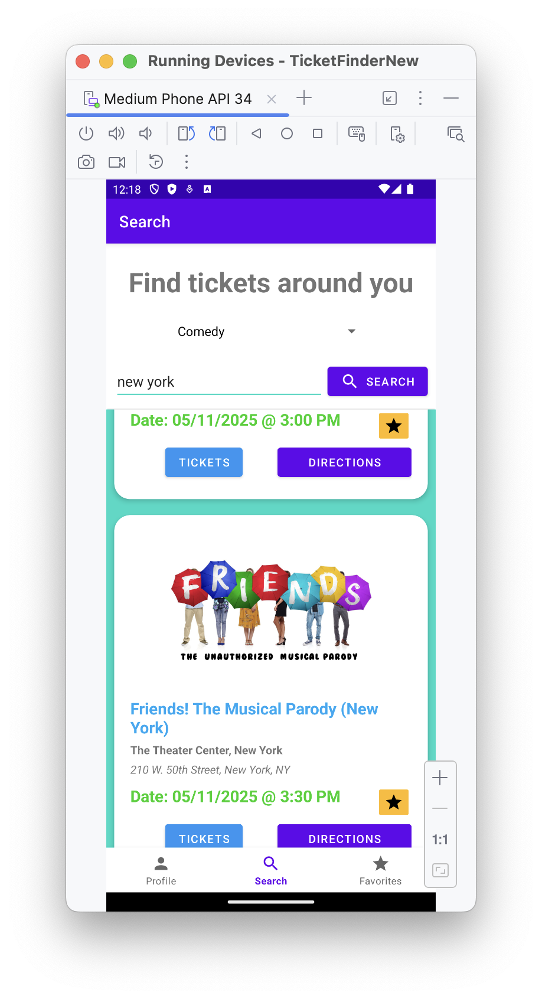

# TicketFinder

---

###  Overview
This is a native android application which allows a user to search for tickets based on category 
and location, and optionally storing their favorites within an account.

This application is powered by cloud firestore, firebase auth, retrofit, and ticketmaster discovery
API.



## Getting Started
Make sure you have Android Studio installed and all set up. You can clone this gtihub repo
in the IDE using the following link:
```https://github.com/gjinrexhaj/TicketFinderNew.git```

Once you've imported the gradle project, in local.properties, create and insert your API key into
a new line as follows:
```
apiKey="your-ticketmaster-discovery-api-key-here"
```

